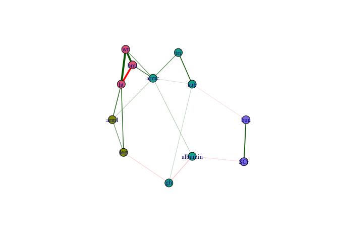
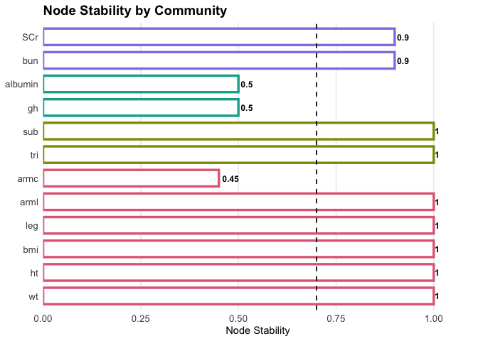
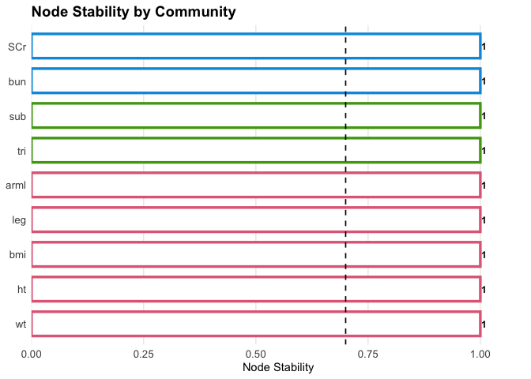
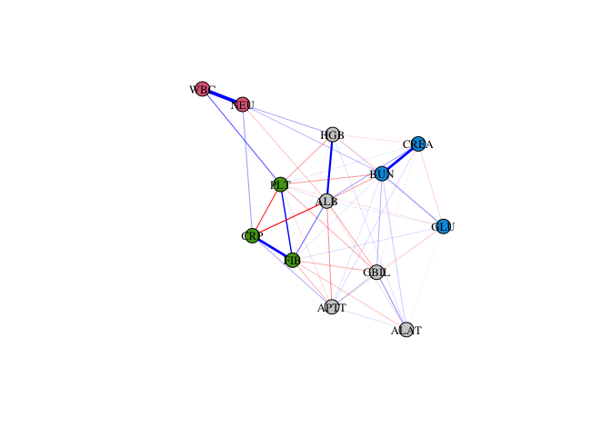
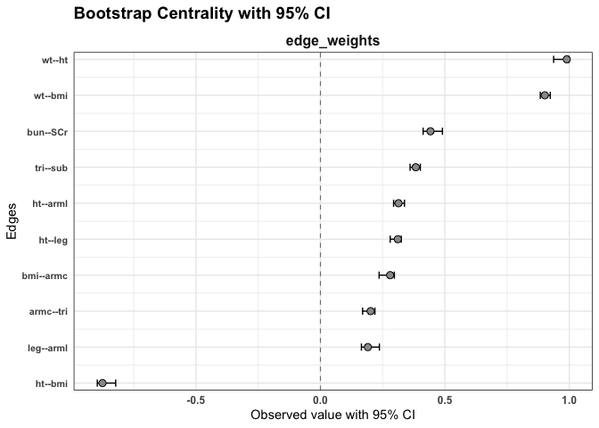
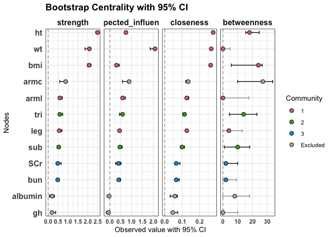
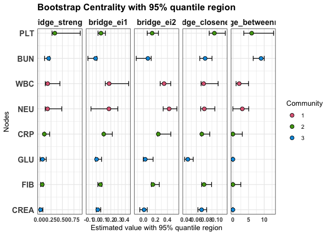
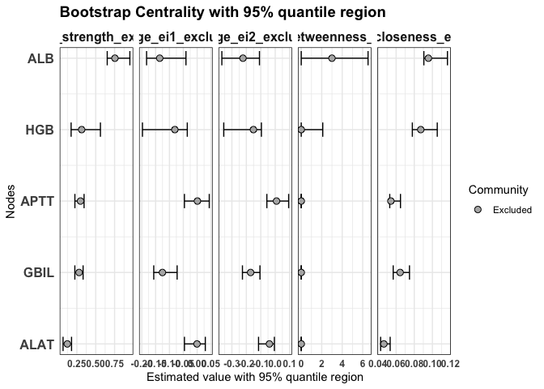

<!-- README.md is generated from README.Rmd. Please edit that file -->

# MixMashNet

**MixMashNet** is an R package for estimating and analyzing **Mixed
Graphical Model (MGM) networks**.  
As the name suggests, the idea is to **“mix and mash”** different types
of variables (continuous, categorical, binary) and even different
**layers of information** (e.g., biomarkers, chronic diseases) to build
networks that are both flexible and interpretable.

With MixMashNet you can:

- estimate **single-layer networks** or more complex **multilayer
  networks**  
- compute **centrality** and **bridge centrality** indices  
- assess **community stability** via non-parametric bootstrap  
- obtain **confidence intervals** for node metrics and edge weights  
- visualize and explore the resulting networks interactively

In short: a bit of *mix*, a bit of *mash*, and you’re ready to build
your network!

## Installation

You can install the development version of MixMashNet from
[GitHub](https://github.com/) with:

``` r
# install.packages("devtools")
devtools::install_github("Mariadmm96/MixMashNet")
```

## Example

Here we demonstrate how to estimate a single-layer MGM and assess its
stability.

### Preparation

Load package and example data

``` r
library(MixMashNet)
data(nhgh) # example dataset bundled with the package
```

Data preparation (mixed: continuous + categorical)

``` r
library(dplyr)
#> 
#> Attaching package: 'dplyr'
#> The following objects are masked from 'package:stats':
#> 
#>     filter, lag
#> The following objects are masked from 'package:base':
#> 
#>     intersect, setdiff, setequal, union
library(tidyr)

# Continuous nodes used in the network (will be "g" in mgm)
cont_vars <- c("wt","ht","bmi","leg","arml","armc","tri","sub","gh","albumin","bun","SCr","age")

# Categorical nodes (will be "c" in mgm)
cat_vars  <- c("sex","re")

# 1) Select variables and keep complete cases (simple for README)
df <- nhgh %>%
  select(all_of(c(cont_vars, cat_vars))) %>%
  drop_na()

# 2) Ensure proper types before building 'type'/'level'
#    - categorical as factors (drop unused levels)
#    - continuous as numeric
df <- df %>%
  mutate(
    across(all_of(cat_vars), ~ droplevels(factor(.))),
    across(all_of(cont_vars), ~ as.numeric(.))
  )

# 3) Build 'type' and 'level' vectors (ORDER must match the columns you pass to mgm)
type  <- c(rep("g", length(cont_vars)), rep("c", length(cat_vars)))
level <- c(rep(1L, length(cont_vars)),
           nlevels(df$sex),
           nlevels(df$re))

# 4) Standardize continuous variables; encode categoricals for mgm:
#    - 'sex' must be 0/1 (male=0, female=1)
#    - 're' becomes 1..K (K = number of levels)
df <- df %>%
  mutate(
    across(all_of(cont_vars), ~ as.numeric(scale(.))),
    sex = as.integer(factor(sex, levels = c("male","female"))) - 1L, # 0/1
    re  = as.integer(re)                                            # 1..K
  ) %>%
  as.data.frame()
```

### Parallel execution (optional)

To speed up bootstrap replications we can enable parallelism with the
`future` framework. Using `multisession` works on **Windows, macOS, and
Linux**.

``` r
library(future)
library(future.apply)

# Use separate R sessions (cross-platform, safe in RStudio)
plan(multisession, workers = max(1, parallel::detectCores() - 1))

# When finished, you can reset with:
# plan(sequential)
```

### Run MixMashNet

We now fit the MGM model.  
Here, covariates (`age`, `sex`, `re`) are included in the estimation to
adjust the network, but they are excluded from the visualization and
centrality metrics.

``` r
fit0 <- mixMN(
  data               = df,
  type               = type,
  level              = level,
  reps               = 0,                # no bootstrap: just estimate the network
  lambdaSel          = "EBIC",
  seed_model         = 42,
  cluster_method     = "louvain",
  exclude_from_graph = c("age", "sex", "re")  # adjust by covariates, exclude them from the graph
)
```

### Quick visualization

Nodes are colored according to their community membership.

``` r
set.seed(2)
plot(fit0)
```



### Node stability

To assess the robustness of community assignment, we re-estimate the
model with non-parametric bootstrap.

``` r
fit1 <- mixMN(
  data               = df,
  type               = type,
  level              = level,
  reps               = 20,             # increase reps for stable results
  lambdaSel          = "EBIC",
  seed_model         = 42,
  seed_boot          = 42,
  cluster_method     = "infomap",
  exclude_from_graph = c("age", "sex", "re")
)
```

Plot item stability:

``` r
plot(fit1, what = "stability")
```



### Excluding unstable nodes

Nodes with stability \< 0.70 are retained in the network but excluded
from the clustering (they will appear in grey). Singletons are also
excluded from communities.

``` r
stab1 <- membershipStab(fit1)
low_stability <- names(stab1$membership.stability$empirical.dimensions)[
    stab1$membership.stability$empirical.dimensions < 0.70
  ]

fit2 <- mixMN(
  data                 = df,
  type                 = type,
  level                = level,
  reps                 = 20,                    
  lambdaSel            = "EBIC",
  seed_model           = 42,
  seed_boot            = 42,
  cluster_method       = "infomap",
  exclude_from_graph   = c("age", "sex", "re"),
  exclude_from_cluster = low_stability,           #exclude unstable nodes
  treat_singletons_as_excluded = TRUE             # declare not to consider singletons as communities
)
```

Recompute stability:

``` r
plot(fit2, what = "stability")
```



### Visualization with excluded nodes

Finally, plot the updated network. Excluded nodes (unstable or
singletons) are displayed in grey.

``` r
set.seed(2)
plot(fit2)
```



### Edge weights

We can compute the edge weights with their 95% confidence intervals.  
Confidence intervals that include zero are shown in grey.

``` r
plot(fit2, statistics = "edges")
```



### General centrality indices

We can compute standard node centrality indices (strength, expected
influence, closeness, and betweenness) together with their 95%
confidence intervals. Confidence intervals that include zero are
highlighted in grey.

``` r
plot(fit2,
  statistics = c("strength", "expected_influence", "closeness", "betweenness")
)
```



### Bridge centrality indices

Bridge centrality indices quantify the role of each node as a connector
between different communities. Here we display bridge strength, bridge
expected influence (EI1 and EI2), bridge closeness, and bridge
betweenness, with their 95% confidence intervals.

``` r
plot(
  fit2,
  statistics = c("bridge_strength", "bridge_ei1", "bridge_ei2", "bridge_closeness", "bridge_betweenness")
)
```



### Bridge centrality indices for excluded nodes

Nodes that were excluded from clustering (e.g. due to low item
stability) can also be evaluated with bridge centrality indices. This
allows us to investigate their potential role in connecting existing
communities, even if they are not assigned to one.

``` r
plot(
  fit2,
  statistics = c("bridge_strength_excluded", "bridge_ei1_excluded", "bridge_ei2_excluded",
              "bridge_betweenness_excluded", "bridge_closeness_excluded")
)
```



✨ That’s it! With just a few lines of code, you can mix, mash, and
explore your networks.
